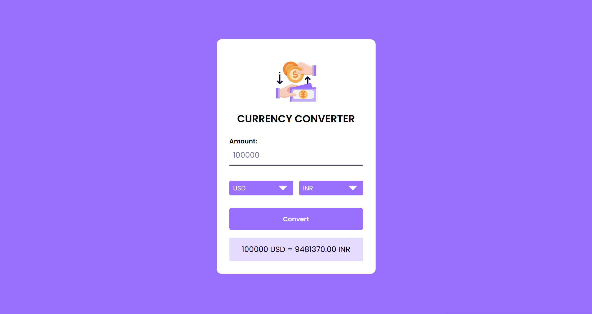
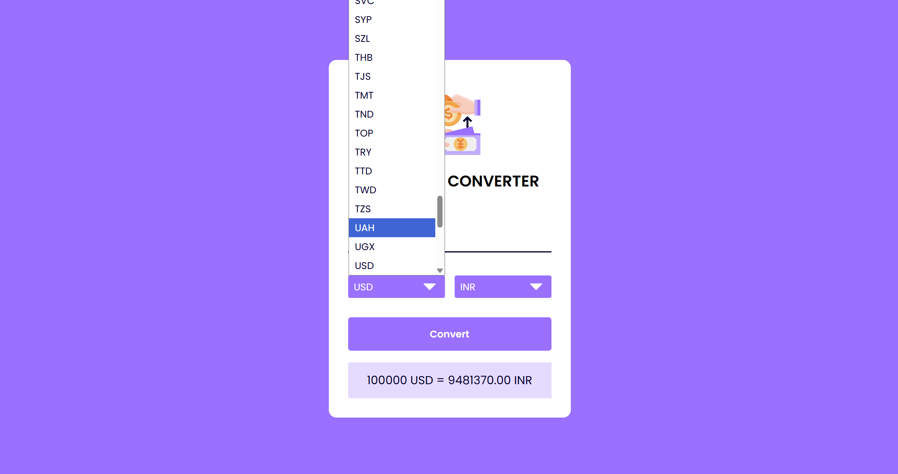
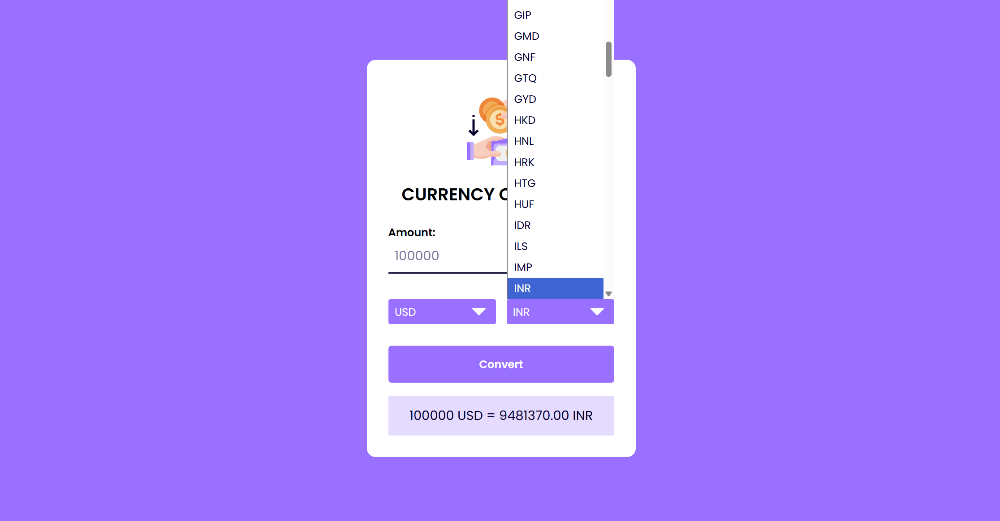

# Currency Converter

A responsive web application that converts currency values in real time using exchange rate APIs.

## Features
- Real-time currency conversion
- Multiple currency support
- Responsive UI
- Clean user experience

## Tech Stack
- HTML
- CSS
- JavaScript

## Project Structure
index.html
style.css
script.js

## How to Run
1. Clone repository
2. Open index.html
3. Start converting currencies

## Future Improvements
- Dark mode
- Currency history
- Graph analytics
## Preview

### Homepage

### Conversion Result

### Mobile View

